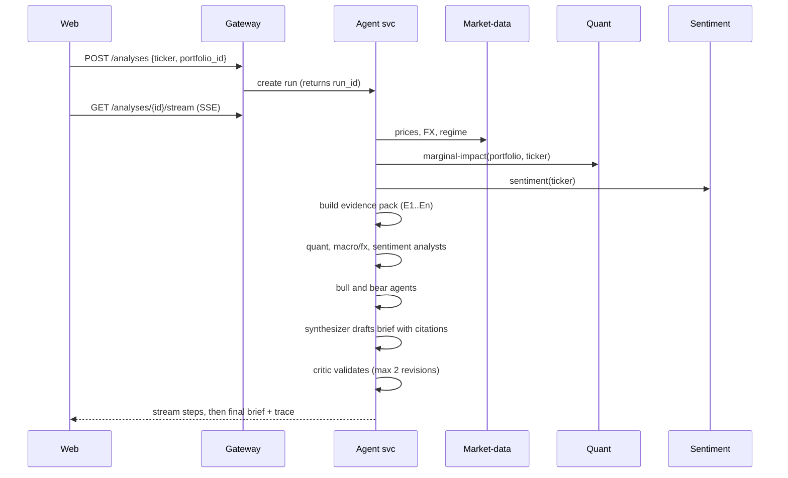

# Tangent: Build Prompt Pack

**What this is:** a prompt pack for building **Tangent** (formerly FinMaths) with an AI coding assistant (Claude Code, Cursor, etc.). It turns the existing Streamlit app into a Dockerized microservice platform with a modern deployable frontend and an evidence-grounded AI decision layer.

**How to use it**
1. Complete **Part C (pre-flight checklist)** yourself first. It covers accounts, keys and tools.
2. Paste **Part A (master prompt)** once as project context. Save it as `CLAUDE.md` or `AGENTS.md` at the repo root so every session sees it.
3. Paste the **Part B phase prompts one at a time**. After each phase, read the summary, run the tests, review the diff, then move on.
4. **Part D** is reference material (env vars, API sketch, schemas) to keep in `docs/`.

---

# PART A: MASTER PROMPT (paste once)

## A1. Role and working agreements

You are a senior full-stack and ML-platform engineer helping me rebuild **FinMaths** (a portfolio-optimization app, now being renamed **Tangent**) as a production-style microservice platform. Follow these rules for the whole project:

1. **Work one phase at a time.** At the end of each phase: summarize what changed, run all tests and linters, list assumptions and open questions, then **stop and wait for my approval**.
2. **Never invent facts about the outside world.** Do not guess API limits, free-tier quotas, prices, tax rates, regulations or model names. If you need one, mark it `TODO(verify)` and tell me. Do not hardcode dependency versions from memory: install the latest stable release, then record it in the lockfile.
3. **Numbers come from deterministic code, never from an LLM.** LLMs may only reason over, explain and cite numbers that services produced.
4. **Simplest thing that works.** No speculative abstraction. Justify every new dependency in one line in the PR description.
5. **Secrets never get committed.** Use `.env` locally (gitignored), `.env.example` in the repo, and platform secrets in CI and cloud.
6. **I develop on Windows** (Docker Desktop with the WSL2 backend, PowerShell). Give commands that work in PowerShell, keep scripts cross-platform (a `justfile` or npm scripts, not bash-only Makefiles), and enforce LF line endings so shell scripts work inside Linux containers.
7. **Tests ship with the code.** Every service gets unit tests in the same PR as its features. Use small commits with conventional messages (`feat:`, `fix:`, `test:`, `docs:`, `chore:`).
8. Keep an **ADR** (architecture decision record) in `docs/adr/` for every non-obvious choice.
9. **Naming:** the product is called **Tangent** (the name nods to the tangency portfolio, the max-Sharpe point on the efficient frontier). Tagline: *Portfolio decisions you can trace.* Use "Tangent" for the repo, package scope, Docker image names (`tangent-<service>`), UI copy and docs. The old name "FinMaths" appears only when referring to the legacy code in `legacy/finmaths/` (the folder name stays as is) and in the README's "formerly FinMaths" note.
10. This is an **educational decision-support tool, not investment advice**. All user-facing AI output must carry that disclaimer and avoid directive language ("you should buy", "guaranteed").

## A2. Product idea

**Problem:** retail investors do not have access to institutional-style portfolio construction that accounts for real constraints such as tax, inflation, currency risk and concentration. They also lack a way to ask "what would adding this asset do to *my* portfolio?" with answers they can check.

**Solution:** The legacy FinMaths app already builds a mathematically optimized portfolio from a risk profile. Tangent (v2) adds a **Decision Studio**: for any asset, it computes the *measured* impact on the user's portfolio, then lets specialist agents (quant, macro and currency, sentiment, bull, bear, critic) explain it. Every claim in the final brief must cite an evidence item produced by a service, and a critic rejects claims it cannot trace.

**What makes it different from a generic "AI stock advisor":**
- It reports marginal impact on *your* portfolio (Sharpe, volatility, drawdown, concentration), computed by the optimizer, not an opinion.
- It makes every claim traceable and shows the agent trace.
- It evaluates itself, with a walk-forward backtest for the quant layer and groundedness and fault-injection tests for the agents.

## A3. Existing system (legacy)

The current code lives in `legacy/finmaths/`. Read it before designing anything. It is a Streamlit monolith with these modules: `app.py`, `data_fetcher.py`, `portfolio_optimizer.py`, `risk_profiler.py`, `projections.py`, `visualizations.py`, `llm_engine.py`, `db.py`, `schema.sql`.

**Key features to preserve**
- Risk profiler that sets asset-class bounds by risk score (for example capping equity for conservative users).
- Market data from Yahoo Finance (`yfinance`) cached in PostgreSQL with a 24-hour TTL via bulk upsert.
- Log returns, USD to INR conversion, tax (LTCG and debt) and inflation (6% p.a.) adjusted real returns.
- Max-Sharpe optimization with SciPy SLSQP, with constraints: weights sum to 1, asset caps (15%), sector caps (25%), risk-profile class bounds.
- 10,000-point Monte Carlo cloud for the efficient frontier; Monte Carlo wealth projections with 95% confidence interval, worst-case drawdown and goal-achievement probability.
- Correlation heatmap and efficient frontier charts.
- AI chat concierge (Groq) grounded in the generated metrics, with an automatic initial briefing.
- Persistent `assets` metadata, `prices` cache and `portfolio_runs` audit log.

**Known weaknesses to fix (treat as requirements)**
1. Synthetic assets (FDs, bonds, REITs) use random noise. Replace with a deterministic yield-accrual model, or real listed proxies where possible, and document each assumption in the assets table.
2. The Monte Carlo path count is inconsistent between docs (1,000 vs 10,000). Make it one documented, configurable parameter, with a **seeded RNG** and the seed stored in each run so results are reproducible.
3. Historical covariance is noisy. Add Ledoit-Wolf shrinkage as an option and compare it against the sample covariance in the backtest.
4. Replace "real-time" wording with "daily close, refreshed within 24h".
5. Tax and inflation constants are hardcoded. Move them into a config table with a source and as-of date, user-overridable, labelled as assumptions (`TODO(verify)` current rules).
6. DB connections are not pooled and inputs are not validated. Add pooling and Pydantic validation.
7. There is no out-of-sample evaluation. Add a walk-forward backtest.
8. The setup instructions contain hardcoded local paths.

## A4. Target features

**Parity (must match legacy):** everything under "Key features to preserve", in the new UI.

**New**
1. **Decision Studio:** pick an asset; get the marginal impact on the user's portfolio (before and after Sharpe, volatility, max drawdown, concentration), an optimizer re-run with the asset included, and a cited multi-agent brief with a bull vs bear panel.
2. **Sentiment service:** recent headlines per asset, LLM-scored in batches with structured output, cached by content hash.
3. **Currency lens:** asset return split into local-currency return and FX return for an INR investor, with FX trend and volatility. Add a note that overseas investment limits may apply (`TODO(verify)` for the current rules).
4. **Market regime snapshot:** rule-based indicators (index trend, volatility index level, rate trend) from available data. No predictions.
5. **Trending screener:** over a curated universe (about 60-100 assets), rank by momentum, volume anomaly and news-volume spikes. Explicitly describe it as screening, not prediction.
6. **Backtest Lab:** walk-forward comparison of max-Sharpe (sample covariance), max-Sharpe (shrinkage), minimum variance and equal weight.
7. **Agent trace and evaluation dashboard:** per-run timeline (agent start and end, tokens, cost estimate, tool calls, retries, errors) plus aggregate metrics across runs and models.
8. **Accounts and history:** guest-first, optional sign-up, saved portfolios and run history.
9. **Demo mode:** bundled sample data and recorded LLM responses so the app always demos even if an external API is down.

**Stretch (only if time remains):** PDF report export, watchlist, forward paper-trading log of recommendations.

## A5. Architecture

Frontend and six backend services, plus PostgreSQL and Redis.

| Service | Responsibility | Why it is separate | Owns |
|---|---|---|---|
| `web` | Next.js UI | Independently deployable static and edge frontend | none |
| `gateway` | Auth (JWT), rate limiting, CORS, request validation, routing, OpenAPI aggregation | One public entry point; backends stay private | none |
| `market-data` | Prices, FX, asset metadata, regime snapshot, screener; provider abstraction (primary plus fallback), cache, demo fixtures | External data is the least reliable dependency, so isolate and cache it | `market.*` schema |
| `quant` | Optimizer, efficient frontier, Monte Carlo, marginal-impact, backtest | CPU-bound, stateless, scales independently | none (stateless) |
| `sentiment` | News ingest, LLM headline scoring, caching | Separate cost and failure profile (LLM plus news API) | `sentiment.*` schema |
| `agent` | Evidence-pack builder, specialist agents, critic, trace, SSE streaming, grounded chat | Long-running, LLM-bound workflow with its own observability | `agent.*` schema |
| `portfolio` | Users, portfolios, run history and audit log | Sole owner of user data | `portfolio.*` schema |

**Rules**
- A service never reads another service's tables. It calls its API.
- Call graph: `web → gateway → {market-data, quant, sentiment, agent, portfolio}`; `quant → market-data`; `agent → market-data, quant, sentiment`.
- One Postgres instance with a **schema per service** (cheaper than separate DBs; note the trade-off in an ADR).
- Redis is for caching and rate limiting only. **No Celery or task queue in v1.** The Monte Carlo and optimizer calls are fast vectorized NumPy, so run them in a thread pool. Agent runs are long-lived tasks tracked in the `agent.runs` table and streamed over **Server-Sent Events**. Revisit a queue only if load testing shows a need (record in an ADR).
- Resilience: timeouts on every outbound call, bounded retries with backoff for idempotent GETs, and graceful degradation. If sentiment is down, the brief says "sentiment unavailable" instead of failing.
- Contracts: a shared `libs/contracts` package of Pydantic models; generate OpenAPI and a typed TypeScript client from it.

**Decision Studio request flow**


## A6. Tech stack (with rationale)

| Layer | Choice | Why |
|---|---|---|
| Frontend | Next.js (App Router) + TypeScript (strict), Tailwind, shadcn/ui, TanStack Query, Zod, typed client from OpenAPI, Recharts plus Plotly (or visx/d3) for the frontier and heatmap | Modern, deployable on Vercel or similar, accessible primitives |
| Services | Python (current stable), FastAPI, Pydantic v2, SQLAlchemy 2, Alembic, httpx | You already know the Python quant stack, so reuse the code |
| Quant | NumPy, Pandas, SciPy, scikit-learn (Ledoit-Wolf) | Same math, now behind an API |
| LLM access | A thin provider-agnostic client (LiteLLM or equivalent) with config-driven model names; Groq by default, a second provider for comparison | Enables model comparison and avoids vendor lock-in |
| Data | PostgreSQL (hosted), Redis (cache and rate limit) | Existing schema carries over |
| Packaging | Docker (multi-stage, non-root, pinned base images), Docker Compose with profiles | Local parity with the cloud |
| Dependency locking | `uv` (`uv.lock`) for Python, `pnpm` (`pnpm-lock.yaml`) for Node | Reproducible builds |
| CI/CD | GitHub Actions, GHCR for images | Free for public repos (`TODO(verify)` limits) |
| Observability | Structured JSON logs with a request-id propagated across services, `/health` and `/ready` on every service, optional Sentry and OpenTelemetry | Debuggable microservices |

**Hosting plan:** frontend on Vercel (or Cloudflare Pages); backend containers on one container host chosen in Phase 0 (Render, Fly.io, Railway or Cloud Run); managed Postgres (for example Neon or Supabase); managed Redis (for example Upstash). All `TODO(verify)`: free-tier limits, cold starts, SSE support and timeouts, and region latency.

## A7. Agent design

**Core principle: evidence first.** Before any LLM runs, the agent service builds an **evidence pack**: a list of items from deterministic services:

`{id: "E12", kind: metric|series|news|fx|regime, label, value, unit, as_of, source_service, params_hash}`

Agents receive only this pack and the user's portfolio summary. They cannot browse or invent data.

**Agents** (each a prompt file under `services/agent/prompts/`, versioned by content hash)
| Agent | Input | Output |
|---|---|---|
| Quant analyst | marginal-impact metrics, risk metrics | structured findings with evidence ids |
| Macro and currency analyst | FX series, regime indicators | structured findings |
| Sentiment analyst | scored headlines | structured findings |
| Bull | all findings | strongest supported case for adding the asset |
| Bear | all findings | strongest supported case against |
| Synthesizer | bull, bear, findings | the final brief |
| Critic | brief plus evidence pack | verdict plus a list of issues |

**Brief schema (Pydantic, validated):** `summary`, `impact_on_portfolio` (before and after deltas), `bull_case[]`, `bear_case[]`, `currency_view`, `sentiment_view`, `regime_view`, `risks[]`, `what_would_change_this[]`, `confidence` (low, medium, high, with a reason), `claims[]` (each `{text, evidence_ids[]}`), `disclaimer`.

**Critic**
- *Deterministic checks:* every claim has at least one evidence id; every id exists; numbers in the claim text match the cited value within a tolerance; no forbidden directive phrases.
- *LLM check:* contradictions between bull, bear and synthesis; unsupported inference.
- At most two revision loops, then output the best brief with any remaining issues flagged openly.

**Safety:** treat news text as untrusted data. Strip markup and URLs, wrap it in clearly delimited data blocks, never let content from news trigger tool calls, and enforce the output schema. Use low temperature for analysts and the critic.

**Cost and latency controls:** cache sentiment scores by content hash; cache evidence packs by (ticker, portfolio hash, date); per-run token budget; per-user rate limits at the gateway.

**Trace schema:** one row per step with `run_id, agent, started_at, ended_at, model, prompt_version, temperature, tokens_in, tokens_out, cost_estimate, tool_calls[], retries, error, output_ref`. A run row stores the full configuration so any run is reproducible.

## A8. Evaluation plan

1. **Quant (deterministic, rigorous):** walk-forward backtest with an expanding window and periodic re-optimization. Compare max-Sharpe (sample cov), max-Sharpe (shrinkage), min-variance and equal weight. Report out-of-sample Sharpe, max drawdown and turnover.
2. **Agents:**
   - Groundedness: share of claims with valid, matching citations.
   - Numeric accuracy: cited numbers matching evidence.
   - Consistency: variation across 3 runs on the same input.
   - Critic catch rate: inject fabricated numbers and missing citations into drafts, then measure detection.
   - Latency, tokens and cost per model.
3. **Model comparison:** at least two models on the same cases.
4. **Caveat to document:** do **not** claim an LLM "beat the market" in a historical backtest. Models may have seen that history during training, so results are contaminated. Judge the agent layer on groundedness and consistency, and optionally log recommendations with timestamps for a forward paper test.

## A9. Repo layout

```
tangent/
  apps/web/                  # Next.js frontend
  services/
    gateway/  market-data/  quant/  sentiment/  agent/  portfolio/
    (each: app/, tests/, Dockerfile, pyproject.toml, uv.lock)
  libs/
    contracts/               # Pydantic models, OpenAPI export
    common/                  # logging, config, http client, request-id middleware
    llm/                     # provider-agnostic LLM client
  infra/
    compose/                 # docker-compose.yml, profiles (core, full, test)
    db/migrations/           # Alembic per schema
    deploy/                  # host-specific configs
  tests/e2e/                 # Playwright
  legacy/finmaths/           # original app, read-only reference
  docs/                      # architecture, adr/, api, runbook, evaluation
  .github/workflows/
  .env.example  justfile  CLAUDE.md  README.md  DISCLAIMER.md
```

## A10. Non-functional requirements

- **Security:** JWT auth with a guest mode, input validation on every endpoint, CORS locked to known origins, rate limits (strictest on LLM endpoints), dependency scanning, no secrets in images or logs.
- **Reliability:** health and readiness endpoints, timeouts and retries, graceful degradation, demo mode.
- **Performance:** optimizer under 2 seconds and simulation under 3 seconds for typical portfolios (measure and record, adjust if unrealistic); price cache hit rate logged.
- **Accessibility and UX:** keyboard navigation, visible focus, WCAG-aligned contrast, reduced-motion support, responsive down to mobile, a table view alternative for every chart.
- **Design direction:** do a short design-plan pass before building the UI. Define 4-6 named colors, typefaces with roles, and a layout concept. Keep continuity with the existing midnight-navy identity if it still works, but avoid a generic card-grid SaaS look. Choose **one memorable element** (suggestion: an interactive efficient-frontier view that responds to the risk slider) and keep everything around it quiet. Use motion only to show state changes.

## A11. Out of scope

Real brokerage integration, order placement, real-money advice, price prediction, intraday data, mobile apps, multi-tenant billing.

## A12. Definition of done

Parity with legacy features; all new features working in the cloud deployment; tests green in CI; the evaluation dashboard populated from real runs; docs complete; dependencies locked; a 3-minute demo script that works in demo mode.

---

# PART B: PHASE PROMPTS (paste one at a time)

Effort key: **S** about half a day, **M** 1-2 days, **L** 3+ days. Treat as relative sizes, not promises.

## Phase 0: Decisions and scope freeze (S)

**Paste:**
> Read `CLAUDE.md` and everything in `legacy/finmaths/`. Do not write code yet. Produce: (1) a port map listing each legacy module and which service and function it moves to; (2) a risk register of the top 10 technical risks (data provider, free-tier limits, SSE through hosts, cold starts, LLM cost, covariance instability, etc.) with mitigations; (3) a proposed decision log with 2-3 options and a recommendation each for: backend host, auth approach, news source, LLM models for comparison, and the curated asset universe; (4) a scope-freeze list separating must-have from stretch. Write these to `docs/adr/0001-*.md` and `docs/scope.md`. Mark every external fact `TODO(verify)`.

**Checklist**
- [ ] Port map reviewed
- [ ] Decisions chosen and logged
- [ ] Scope frozen

**Done when:** I have approved the decision log and the must-have list.

## Phase 1: Environment setup on Windows (S)

**Paste:**
> Set up the repository and the development environment. Create the monorepo skeleton from A9, `.gitignore`, `.gitattributes` (force LF for `*.sh`, `Dockerfile*`, `*.yml`), `.editorconfig`, `.env.example`, a `justfile` (or npm scripts) with tasks `doctor`, `up`, `down`, `test`, `lint`, `fmt`, and a `doctor` script that checks: Docker Desktop (WSL2 backend), `docker compose`, git, Python and `uv`, Node and `pnpm`, and `just`. Add pre-commit hooks (ruff, formatting, secret scan). Give me PowerShell install steps for anything missing. Copy the legacy code into `legacy/finmaths/` untouched.

**Checklist**
- [ ] `just doctor` is all green
- [ ] Repo initialized, first commit, remote pushed
- [ ] Pre-commit installed
- [ ] Secrets scan passes

**Done when:** a fresh clone plus `just doctor` works on my machine.

## Phase 2: Foundation (M)

**Paste:**
> Build the shared foundation: `libs/common` (JSON logging, config via Pydantic Settings, request-id middleware, httpx client with timeouts and retries), `libs/contracts` (Pydantic models for assets, prices, portfolio requests and results, evidence items, brief), and a service template with `/health` and `/ready`. Create the Docker Compose file with Postgres and Redis (named volumes, healthchecks), per-service schemas, and Alembic migrations. Port `schema.sql` into migrations. Add the first CI workflow (lint, type-check, unit tests per service, frontend lint). Each Dockerfile must be multi-stage, non-root, with a pinned base image tag and a `.dockerignore`.

**Checklist**
- [ ] `just up` starts Postgres and Redis healthy
- [ ] Migrations apply cleanly from zero
- [ ] Service template builds and passes health checks
- [ ] CI is green on a PR

**Done when:** an empty template service runs in Compose and in CI.

## Phase 3: Port the core services (L)

**Paste:**
> Implement `market-data`, `quant` and `portfolio` by porting legacy logic, fixing the weaknesses in A3 as you go. `market-data`: provider interface with yfinance primary and a fallback or fixture provider, Postgres cache with TTL and bulk upsert, FX series, asset metadata, demo-mode fixtures. `quant`: risk-profile bounds, log returns, covariance (sample and Ledoit-Wolf), SLSQP max-Sharpe with constraints, frontier sampling, Monte Carlo projections with a seeded RNG and configurable path count, tax and inflation adjustment from the config table, and a deterministic model for FDs and bonds. `portfolio`: users (guest and registered), portfolios, runs and audit log. **Before changing behavior, write golden tests** that capture the legacy outputs for a fixed input, then show where and why the new outputs differ.

**Checklist**
- [ ] Constraint tests: weights sum to 1, bounds respected, caps respected
- [ ] Golden tests against legacy numbers (differences explained)
- [ ] Same seed gives the same simulation
- [ ] Provider outage falls back cleanly
- [ ] Connection pooling in place

**Done when:** I can call all three services by API and get legacy-equivalent results.

## Phase 4: Gateway and new frontend MVP (L)

**Paste:**
> Build `gateway` (JWT and guest tokens, rate limiting via Redis, CORS, aggregated OpenAPI) and then `apps/web`. First write the short design plan from A10 and show it to me for approval before coding the UI. Then implement feature parity with the Streamlit app: landing, risk profiler wizard, asset selection and constraints, results page (allocation, efficient frontier, correlation heatmap, Monte Carlo fan chart, tax/inflation/FX breakdown), history. Use a generated typed API client, TanStack Query, loading and error states that explain what went wrong, and a table alternative for each chart. The Groq chat concierge can be a placeholder until Phase 6.

**Checklist**
- [ ] Every legacy feature reachable in the new UI
- [ ] Keyboard-only walkthrough works
- [ ] Mobile layout checked
- [ ] Typed client regenerates from OpenAPI with one command
- [ ] Component tests and one Playwright happy-path test

**Done when:** a user can complete the full legacy flow in the new UI against Compose.

## Phase 5: Sentiment and the agent service (L)

**Paste:**
> Implement `sentiment` (news provider interface plus fixtures, batch LLM scoring with a strict JSON schema, content-hash cache) and `agent`. In `quant`, add the `marginal-impact` endpoint (re-optimize with the candidate asset and return before and after metrics) and the regime and trending logic in `market-data`. In `agent`: the evidence-pack builder, the seven agents from A7 with versioned prompt files, the critic with deterministic and LLM checks, a trace recorder, SSE streaming, run persistence, per-run token budget, and a provider-agnostic LLM client. Add a `recorded` LLM mode that replays saved responses so tests and demo mode never need a live key. Write tests for the critic's deterministic checks first.

**Checklist**
- [ ] Evidence ids are unique and stable
- [ ] Brief schema validation rejects malformed outputs
- [ ] Critic catches injected fake numbers and missing citations
- [ ] News text injection test (instructions inside a headline are ignored)
- [ ] A sentiment outage degrades gracefully
- [ ] Traces persisted for every run

**Done when:** one API call produces a validated, cited brief with a full trace, in both live and recorded modes.

## Phase 6: Decision Studio UI and grounded chat (M)

**Paste:**
> Build the Decision Studio page: asset picker, before and after portfolio impact, bull vs bear panel, claim-level citations that open an evidence drawer, currency lens, sentiment and regime sections, and a live agent timeline fed by SSE. Add the discovery screener page. Replace the placeholder chat with a concierge grounded in the latest evidence pack and portfolio results, using the same critic rules. Every AI-generated surface shows the disclaimer.

**Checklist**
- [ ] Clicking a claim shows its evidence
- [ ] Streaming works, with a polling fallback if SSE is unavailable
- [ ] Empty, error and offline states are written for the user
- [ ] Disclaimer visible on all AI output

**Done when:** a first-time user can analyze an asset end to end without help.

## Phase 7: Evaluation harness and dashboard (M)

**Paste:**
> Implement the evaluation plan in A8. Add a Backtest Lab endpoint and page, and an evaluation runner (CLI plus a manually triggered workflow) that runs a fixed case set across at least two models and writes results to `agent.evals`. Include the fault-injection test for the critic. Build the `/evals` dashboard with an overall view and a drill-down into runs and agents (timeline, latency, tokens, cost, groundedness, errors). Write `docs/evaluation.md` with the method, results and the contamination caveat.

**Checklist**
- [ ] Backtest reproducible from a seed and a config
- [ ] At least 30 evaluated runs across 2 or more models
- [ ] Charts have table alternatives
- [ ] Results written up honestly, including weak spots

**Done when:** I can show a bottleneck agent and a model comparison from real data.

## Phase 8: Hardening (M)

**Paste:**
> Harden the platform: security review against the OWASP API top 10 for each endpoint, rate-limit tuning, input size limits, secrets audit of images and git history, dependency audit (`pip-audit`, `pnpm audit`, an image scan), error handling review, structured log review (no keys or PII), timeouts and circuit-breaker behavior under injected failures, a load test of `quant` and `agent`, and demo-mode verification with all external networks blocked. Fix what you find and list anything deferred.

**Checklist**
- [ ] No high or critical findings left open
- [ ] No secrets in repo, images or logs
- [ ] Failure injection tested: provider down, LLM timeout, DB restart
- [ ] Load test results recorded in `docs/`

**Done when:** I have a short hardening report with before and after.

## Phase 9: Testing and CI/CD (M)

**Paste:**
> Complete the test pyramid and pipelines. Unit tests per service (target 80% or more on `quant` and `agent` logic), contract tests that fail when an OpenAPI change breaks the typed client, integration tests against Compose, Vitest and Playwright for the web app, and LLM tests using recorded responses only. Workflows: `ci.yml` (lint, type-check, unit, build images), `integration.yml` (Compose plus e2e), `release.yml` (build and push images to GHCR with commit-SHA tags, then deploy), and a manual `eval.yml` that uses live keys. Cache dependencies, use GitHub environments for secrets, and add Dependabot or Renovate.

**Checklist**
- [ ] CI green from a clean clone
- [ ] No test needs a live API key
- [ ] Image tags are immutable (SHA); `latest` is not used for deploys
- [ ] Branch protection requires CI

**Done when:** merging to main builds, tests and ships images automatically.

## Phase 10: Cloud deployment (M)

**Paste:**
> Deploy per the hosting decision in the ADR. Create the managed Postgres and Redis, run migrations as a release step, deploy each backend container with environment secrets and health checks, wire private service URLs, and deploy `web` with the gateway URL. Verify SSE end to end through the host, set CORS to the real origins, and add a post-deploy smoke test (health, one optimize call, one Decision Studio run in demo mode). Document rollback (redeploy the previous image SHA, migration down-steps) and cold-start mitigation. Record real latency from the deployed system.

**Checklist**
- [ ] All `/ready` endpoints green in the cloud
- [ ] Smoke test passes after each deploy
- [ ] Rollback rehearsed once
- [ ] LLM spend limits set on every key
- [ ] A public demo URL works from a phone

**Done when:** the live URL completes the full user journey and the smoke test is automated.

## Phase 11: Documentation, dependency lock and release (S-M)

**Paste:**
> Finish documentation and release. Write: `README.md` (title "Tangent" with a "formerly FinMaths" line, what and why, a GIF or screenshots, three-command quickstart for Windows, architecture diagram, env vars, deploy steps, limitations), `docs/architecture.md`, ADR index, `docs/api.md` (generated from OpenAPI), `docs/runbook.md` (ops, rollback, common failures), `docs/evaluation.md`, `DISCLAIMER.md`, `CONTRIBUTING.md`, `CHANGELOG.md`, and a 3-minute `docs/demo-script.md`. Lock dependencies: commit `uv.lock` and `pnpm-lock.yaml`, pin the Python and Node versions (`.python-version`, `.nvmrc`, the `packageManager` field), export hashed requirements for Docker builds, pin base image tags, and generate `docs/VERSIONS.md` listing the resolved versions. Verify the lock by building from a clean clone. Tag `v1.0.0`.

**Checklist**
- [ ] Clean-clone build succeeds using only locked versions
- [ ] README quickstart tested by someone else
- [ ] Limitations section is honest
- [ ] Release tagged

**Done when:** a stranger can run it locally from the README and a reviewer can follow the demo script.

---

# PART C: PRE-FLIGHT CHECKLIST (you do this before Phase 0)

## C1. Accounts and keys

Check free-tier limits and terms yourself before relying on any of them.

| Item | Needed for | Notes |
|---|---|---|
| GitHub account, repo, GHCR access | Code, CI, images | Public repo keeps Actions simplest (`TODO(verify)` limits) |
| Primary LLM key (Groq, you already use it) | Agents, sentiment, chat | Set a spend or rate limit on the key |
| Second LLM provider key | Model comparison in the evaluation | Any provider with an API; free tiers may use your inputs for training, so send only non-sensitive data |
| News source key or RSS feeds | Sentiment | Free tiers are tight; the service must cache and have fixtures |
| Backup market-data provider (optional) | Fallback if yfinance fails | yfinance is unofficial and can break or rate-limit |
| Hosted Postgres account | Cloud database | Compare free-tier storage, pausing and region |
| Hosted Redis account | Cache and rate limit | Compare request quotas |
| Backend container host account | Backend services | Needs Docker support, SSE, private networking, reasonable cold starts |
| Frontend host account (Vercel or similar) | Web | Free tier is fine for a demo |
| Error monitoring account (optional) | Sentry | Optional |
| Name availability for "Tangent" | Repo, domain, image names | Check GitHub org or repo name, domain, npm scope and PyPI names, and search for existing fintech products with the same name (`TODO(verify)`); keep a fallback name ready |

## C2. Tools on your Windows machine

Docker Desktop with the WSL2 backend; Git; Python plus `uv`; Node plus `pnpm`; `just` (for example via `winget`); VS Code or your editor; optionally `psql`. `just doctor` in Phase 1 will verify all of it.

## C3. Decisions to make (or let Phase 0 recommend)

| Decision | Options to weigh |
|---|---|
| Backend host | Render, Fly.io, Railway, Cloud Run |
| Auth | Own JWT (simplest), or a hosted auth provider |
| News source | Free news API, RSS, or fixtures only |
| LLM comparison pair | Groq-hosted open model vs another provider's small model |
| Asset universe | Indian large caps, a few global ETFs, gold, bonds and FDs as modelled assets |

## C4. Day-0 smoke test

1. A hello-world FastAPI container runs under Docker Desktop on Windows.
2. A hello-world Next.js app deploys to the frontend host.
3. The Groq key returns a completion; the second provider key does too.
4. `yfinance` returns prices for one Indian and one US ticker, and one FX pair.
5. The hosted Postgres accepts a connection from your machine.
6. The container host can deploy a hello-world container and stream SSE through it.

If step 4 or 6 fails, fix or change the choice before building.

## C5. Housekeeping

- Use a clean repository, with the legacy code copied in as read-only reference.
- Keep real keys only in `.env` (gitignored) and platform secrets.
- If any legacy code was already submitted elsewhere, keep the git history clear about what is new work.

---

# PART D: REFERENCE

## D1. Environment variables

| Variable | Used by | Notes |
|---|---|---|
| `DATABASE_URL` | all DB-owning services | One URL per service if you later split databases |
| `REDIS_URL` | gateway, market-data, sentiment, agent | Cache and rate limit |
| `JWT_SECRET`, `JWT_EXPIRY_MINUTES` | gateway, portfolio | Long random value |
| `ALLOWED_ORIGINS` | gateway | Comma-separated frontend origins |
| `LLM_PRIMARY_MODEL`, `LLM_SECONDARY_MODEL` | agent, sentiment | Config-driven |
| `GROQ_API_KEY`, `SECOND_LLM_API_KEY` | `libs/llm` | Never logged |
| `LLM_MODE` | agent, sentiment | `live` or `recorded` |
| `NEWS_API_KEY` | sentiment | Optional if using RSS or fixtures |
| `FALLBACK_MARKET_API_KEY` | market-data | Optional |
| `DEMO_MODE` | all | Use fixtures and recorded LLM output |
| `MC_PATHS`, `MC_SEED` | quant | Documented defaults |
| `RUN_TOKEN_BUDGET` | agent | Per-run cap |
| `SENTRY_DSN` | all | Optional |
| `*_SERVICE_URL` | gateway, agent, quant | Private service addresses |

## D2. API sketch (all behind the gateway as `/api/v1`)

- **auth/portfolio:** `POST /auth/guest`, `POST /auth/register`, `POST /auth/login`; `GET/POST /portfolios`, `GET /runs`
- **market-data:** `GET /assets`, `GET /assets/{ticker}`, `POST /prices/query`, `GET /fx/{pair}`, `GET /regime`, `GET /screener/trending`
- **quant:** `POST /optimize`, `POST /frontier`, `POST /simulate`, `POST /marginal-impact`, `POST /backtest`
- **sentiment:** `GET /assets/{ticker}/sentiment`, `POST /refresh`
- **agent:** `POST /analyses`, `GET /analyses/{id}`, `GET /analyses/{id}/stream` (SSE), `POST /chat`, `GET /evals`

## D3. Database ownership

- `market`: assets, prices, fx_rates, provider_log
- `sentiment`: articles, scores
- `agent`: runs, steps (trace), evidence, evals
- `portfolio`: users, portfolios, runs (audit)
- A shared `config` table (or per-service config tables) for tax, inflation and assumptions, each with `source` and `as_of`.

## D4. Acceptance metrics to report in the final write-up

| Area | Metric |
|---|---|
| Quant | Out-of-sample Sharpe, max drawdown and turnover per strategy; seed reproducibility |
| Agents | Groundedness, numeric accuracy, consistency across runs, critic catch rate under fault injection |
| Platform | p50 and p95 latency per endpoint (local vs cloud), cache hit rate, error rate, cost per analysis |
| Quality | Test coverage, CI duration, number of services deploying independently |

## D5. Compliance and ethics notes to include in the product

- Label the product as educational decision support, not investment advice.
- Explain assumptions (tax, inflation, data source, delay) next to results.
- State known limits: historical estimates are noisy, sentiment is a noisy signal, LLMs can be wrong, the screener is not a prediction.
- Check current regulations for advice, data usage and overseas investing before any public launch (`TODO(verify)`).
